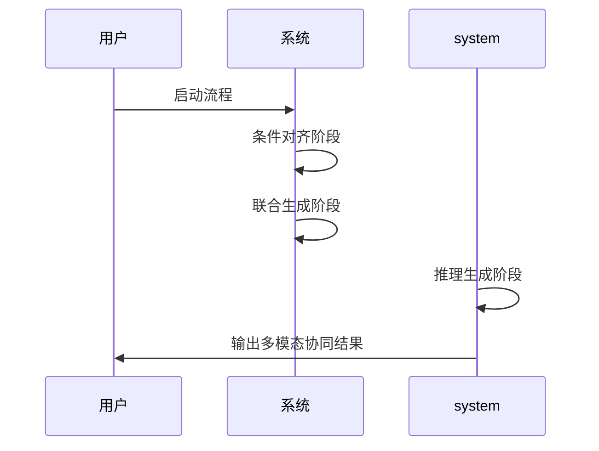

```mermaid
sequenceDiagram
    participant 用户 as 用户
    participant 系统 as 系统
    用户 ->> 系统: 启动流程
    系统 ->> 系统: 条件对齐阶段
    系统 ->> 系统: 联合生成阶段
    system ->> system: 推理生成阶段
    system ->> 用户: 输出多模态协同结果
```