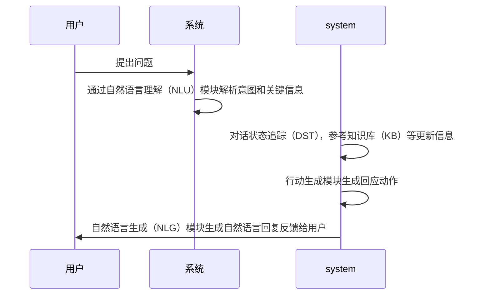

```mermaid
sequenceDiagram
    participant 用户 as 用户
    participant 系统 as 系统
    用户 ->> 系统: 提出问题
    系统 ->> 系统: 通过自然语言理解（NLU）模块解析意图和关键信息
    system ->> system: 对话状态追踪（DST），参考知识库（KB）等更新信息
    system ->> system: 行动生成模块生成回应动作
    system ->> 用户: 自然语言生成（NLG）模块生成自然语言回复反馈给用户
```