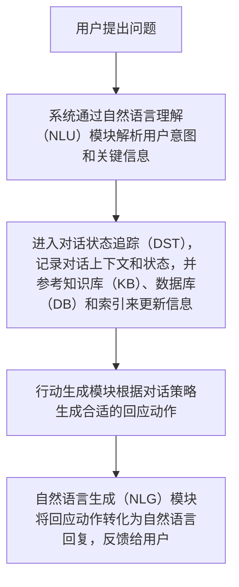

```mermaid
graph TD;
    A[用户提出问题] --> B[系统通过自然语言理解（NLU）模块解析用户意图和关键信息];
    B --> C[进入对话状态追踪（DST），记录对话上下文和状态，并参考知识库（KB）、数据库（DB）和索引来更新信息];
    C --> D[行动生成模块根据对话策略生成合适的回应动作];
    D --> E[自然语言生成（NLG）模块将回应动作转化为自然语言回复，反馈给用户];
```