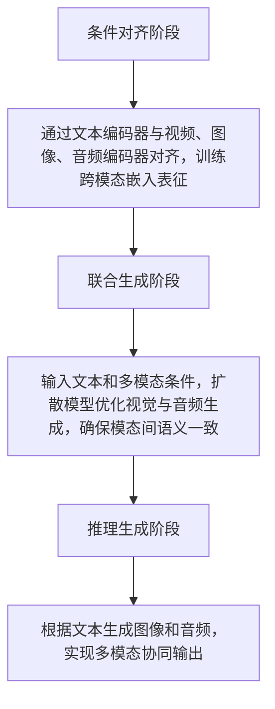

```mermaid
graph TD;
    A[条件对齐阶段] --> B[通过文本编码器与视频、图像、音频编码器对齐，训练跨模态嵌入表征];
    B --> C[联合生成阶段];
    C --> D[输入文本和多模态条件，扩散模型优化视觉与音频生成，确保模态间语义一致];
    D --> E[推理生成阶段];
    E --> F[根据文本生成图像和音频，实现多模态协同输出];
```